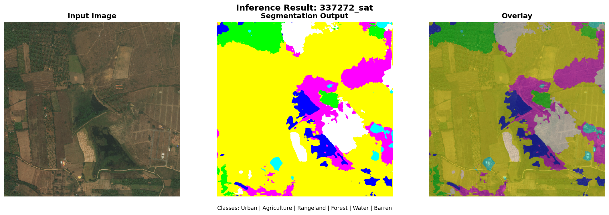
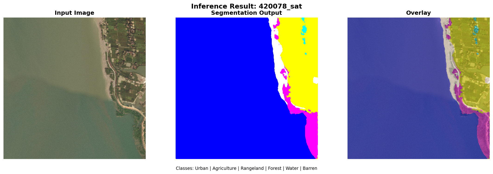
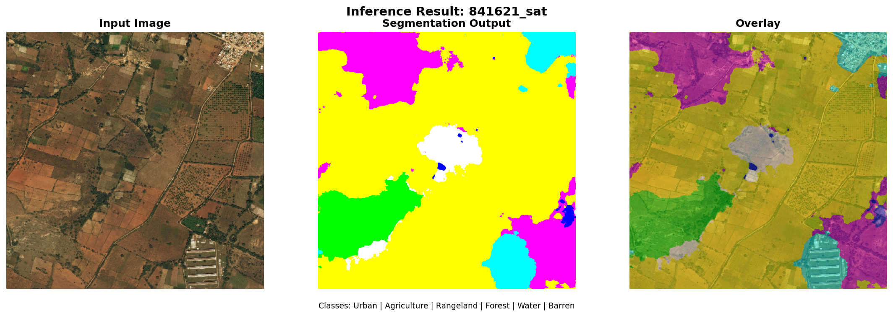

# Point-Supervised Segmentation for Remote Sensing

This project implements semantic segmentation using sparse point annotations instead of dense pixel-wise masks. The core idea is to train a segmentation network using only a few labeled points per class, significantly reducing annotation effort.

---

## 1. Setup Environment

```bash
# Create and activate virtual environment
python -m venv venv
source venv/bin/activate    # Linux/Mac
# venv\Scripts\activate     # Windows

# Install required packages
pip install -r requirements.txt
```

---

## 2. Data Preparation

Run the setup script to organize the dataset:

```bash
python setup.py
```

This will:
- Create necessary directories
- Copy images from `archive/train/` to `data/raw/images/`
- Copy masks from `archive/train/` to `data/raw/masks/`
- Verify all image-mask pairs
- Create train/val/test splits (70/15/15)

After setup:
```
data/raw/
├── images/     # 803 satellite images (*_sat.jpg)
├── masks/      # 803 segmentation masks (*_mask.png)
└── split.json  # Train/val/test indices
```

---

## 3. Training

### Train Baseline Model

```bash
python main.py --mode train --experiment baseline --epochs 30
```

### Train with Custom Settings

```bash
python main.py --mode train \
    --epochs 50 \
    --batch_size 4 \
    --lr 1e-4 \
    --num_points 200
```

### Run Both Experiments (Recommended)

```bash
python main.py --mode train --experiment both
```

This runs two experiments:
1. **Point Density**: Compare 50 vs 200 points per class
2. **Data Augmentation**: Compare with/without augmentation

### Training Arguments

| Argument | Default | Description |
|----------|---------|-------------|
| `--epochs` | 30 | Training epochs |
| `--batch_size` | 4 | Batch size (use 2 if GPU OOM) |
| `--lr` | 1e-4 | Learning rate |
| `--num_points` | 100 | Points per class |
| `--device` | auto | `cuda` or `cpu` |

---

## 4. Experiment Tracking with MLflow

### Start MLflow Server

```bash
mlflow ui --backend-store-uri mlflow_tracking
```

### Access Dashboard

Open browser: **http://localhost:5000**

You can view:
- All training runs
- Loss, IoU, F1 metrics
- Hyperparameters
- Model artifacts

---

## 5. Evaluation

Evaluate a trained model on the test set:

```bash
python main.py --mode evaluate --checkpoint experiments/baseline/[timestamp]/best_model.pth
```

This generates:
- Test metrics (IoU, F1, Precision, Recall)
- Confusion matrix
- Sample prediction visualizations

---

## 6. Inference

Run inference on sample images and save results:

```bash
python inference.py --checkpoint experiments/baseline/[timestamp]/best_model.pth --num_samples 3
```

Or using main.py:

```bash
python main.py --mode inference \
    --checkpoint experiments/baseline/[timestamp]/best_model.pth \
    --num_samples 3 \
    --output_dir .
```

This saves inference results to the current directory:
- `inference_result_1.png`
- `inference_result_2.png`
- `inference_result_3.png`

Each image shows: Input | Segmentation | Overlay

---

## 7. Results

### Output Structure

After training:
```
experiments/[name]/[timestamp]/
├── best_model.pth          # Model weights
├── config.json             # Configuration
├── training_curves.png     # Loss/IoU plots
└── evaluation/
    ├── confusion_matrix.png
    └── visualizations/
        └── sample_*.png
```

### Performance Images

| Image | Location |
|-------|----------|
| Training Curves | `images/metrics/[exp]_training_curves.png` |
| Confusion Matrix | `experiments/[exp]/[timestamp]/evaluation/confusion_matrix.png` |
| Inference Results | `./inference_result_*.png` |

---

## 8. Experiments Summary

### Experiment 1: Point Density

How does the number of labeled points affect performance?

| Points/Class | Mean IoU |
|--------------|----------|
| 50 | ~0.40 |
| 200 | ~0.52 |

**Finding**: More points improve performance, but returns diminish after ~200 points.

### Experiment 2: Data Augmentation

Does augmentation help with sparse supervision?

| Augmentation | Mean IoU |
|--------------|----------|
| No | ~0.38 |
| Yes | ~0.48 |

**Finding**: Augmentation improves IoU by 8-15%, essential for preventing overfitting.

---

## 9. Technical Details

### Partial Cross-Entropy Loss

The loss function only computes gradients on labeled points:

```python
def partial_cross_entropy(pred, target, ignore_index=-1):
    mask = (target != ignore_index)
    return F.cross_entropy(pred[mask], target[mask])
```

### Model Architecture

- U-Net with ResNet34 encoder
- Input: 512x512x3
- Output: 512x512x7 (7 classes)
- Pretrained on ImageNet

### Dataset

DeepGlobe Land Cover - 7 classes:
- Urban (Cyan)
- Agriculture (Yellow)
- Rangeland (Magenta)
- Forest (Green)
- Water (Blue)
- Barren (White)
- Unknown (Black)

---

## 10. Quick Reference

```bash
# Complete pipeline
python setup.py                                         # Step 1: Prepare data
python main.py --mode train --experiment both           # Step 2: Train models
mlflow ui --backend-store-uri mlflow_tracking           # Step 3: View tracking
python main.py --mode evaluate --checkpoint [path]      # Step 4: Evaluate
python inference.py --checkpoint [path] --num_samples 3 # Step 5: Inference
```

---

## Troubleshooting

**CUDA Out of Memory**
```bash
python main.py --mode train --batch_size 2
```

**Dataset Not Found**
```bash
python setup.py --force
```

**Check GPU**
```bash
python -c "import torch; print(torch.cuda.is_available())"
```

---

## Sample Inference Results

After running inference, results are saved as PNG files in the current directory:





Each visualization shows:
- **Left**: Input satellite image
- **Center**: Predicted segmentation mask
- **Right**: Overlay of prediction on input

---

## File Structure

```
point_supervised_segmentation/
├── setup.py              # Data preparation
├── main.py               # Training/evaluation entry point
├── inference.py          # Inference script
├── requirements.txt      # Dependencies
├── configs/
│   └── config.py         # Configuration
├── src/
│   ├── data_loader.py    # Dataset loading
│   ├── loss.py           # Partial CE loss
│   ├── model.py          # U-Net model
│   ├── train.py          # Training loop
│   ├── evaluate.py       # Evaluation
│   ├── metrics.py        # IoU, F1 metrics
│   └── point_sampling.py # Point sampling
├── data/raw/             # Dataset
├── experiments/          # Training outputs
└── images/metrics/       # Saved visualizations
```
